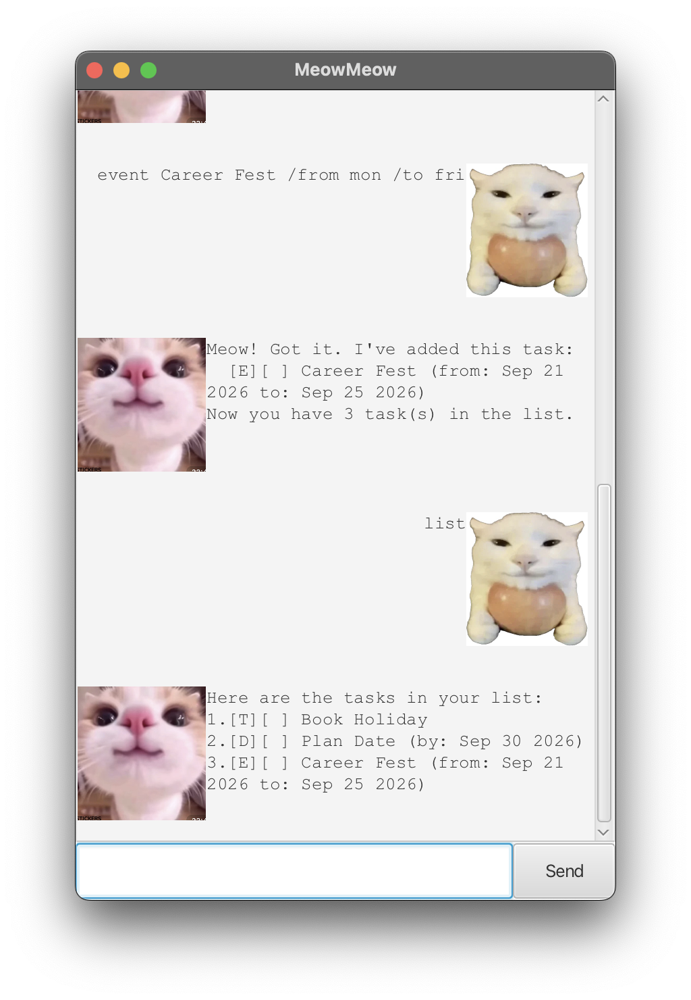

# MeowMeow User Guide



MeowMeow is a desktop task manager you operate by typing. It keeps todos,
deadlines and events in a single list, saves every change to disk immediately,
and talks back like a cat with a clipboard.

It is built for one person managing one list on one machine. Everything below
describes what it does today — including the inputs it deliberately refuses.

## Getting started

1. Make sure you have **Java 25** installed. Check with `java -version`.
2. Download `meowmeow.jar` from the [releases page](https://github.com/ethanlaiii/ip/releases).
3. Put it in a folder of its own. MeowMeow creates a `data` folder beside the
   JAR for its save file, so an empty folder keeps things tidy.
4. Open a terminal in that folder and run:

   ```
   java -jar meowmeow.jar
   ```

5. Type a command into the box at the bottom and press Enter or click **Send**.

## Command summary

| Command | Format | Example |
|---|---|---|
| Add a todo | `todo DESCRIPTION` | `todo read book` |
| Add a deadline | `deadline DESCRIPTION /by DATE` | `deadline submit iP /by 2026-09-18 2359` |
| Add an event | `event DESCRIPTION /from DATE /to DATE` | `event conference /from mon /to wed` |
| List everything | `list` | `list` |
| Mark as done | `mark INDEX` | `mark 2` |
| Mark as not done | `unmark INDEX` | `unmark 2` |
| Delete | `delete INDEX` | `delete 3` |
| Tasks on a date | `on DATE` | `on 2026-09-20` |
| Search | `find KEYWORD` | `find book` |
| Exit | `bye` | `bye` |

Command words are **case-insensitive** — `TODO`, `Todo` and `todo` all work.
`INDEX` refers to the number shown by `list`, counting from 1.

## Dates and times

Anywhere a `DATE` is expected, MeowMeow accepts:

| Form | Example | Means |
|---|---|---|
| ISO date | `2026-09-20` | 20 September 2026 |
| Day/month/year | `20/9/2026` | the same day |
| Either, plus a 24-hour time | `2026-09-20 1830` or `2026-09-20 18:30` | 6:30pm that day |
| A day name | `mon`, `monday`, `FRI`, `Sunday` | the **next** such day |

Day names always mean the next occurrence, never today. If today is Friday,
`fri` means Friday next week. The day is resolved when you type it and stored
as a fixed date, so the task does not drift forward each time you reopen the
app.

Dates are displayed as `Sep 20 2026` or `Sep 20 2026, 6:30PM`.

## Features

### Adding a todo — `todo`

```
todo read book
```

```
Got it. I've added this task:
  [T][ ] read book
Now you have 1 task(s) in the list.
```

### Adding a deadline — `deadline`

The description comes first, the due date after `/by`.

```
deadline submit iP /by 2026-09-18 2359
```

```
Got it. I've added this task:
  [D][ ] submit iP (by: Sep 18 2026, 11:59PM)
Now you have 2 task(s) in the list.
```

### Adding an event — `event`

A start after `/from` and an end after `/to`.

```
event conference /from 2026-10-05 /to 2026-10-07
```

```
Got it. I've added this task:
  [E][ ] conference (from: Oct 05 2026 to: Oct 07 2026)
Now you have 3 task(s) in the list.
```

### Listing tasks — `list`

```
Here are the tasks in your list:
1.[T][ ] read book
2.[D][ ] submit iP (by: Sep 18 2026, 11:59PM)
3.[E][ ] conference (from: Oct 05 2026 to: Oct 07 2026)
```

`[T]`, `[D]` and `[E]` are the task type. `[X]` means done, `[ ]` means not done.

### Marking and unmarking — `mark`, `unmark`

```
mark 1
```

```
Nice! I've marked this task as done:
  [T][X] read book
```

### Deleting — `delete`

```
delete 1
```

```
Noted. I've removed this task:
  [T][X] read book
Now you have 2 task(s) in the list.
```

### Finding tasks on a date — `on`

Shows deadlines falling on that date, and events whose range covers it.
Todos have no date, so they never appear.

```
on 2026-10-06
```

```
Tasks on Oct 06 2026:
1.[E][ ] conference (from: Oct 05 2026 to: Oct 07 2026)
```

Past dates are accepted here — looking back through your history is the point.

### Searching — `find`

Matches the text you type against task descriptions, ignoring case.

```
find book
```

```
Here are the matching tasks in your list:
1.[T][ ] read book
```

### Exiting — `bye`

MeowMeow says goodbye and the window closes a couple of seconds later, so you
can read the farewell.

## Saving

Every change is written immediately to `data/meowmeow.txt`, relative to the
folder you ran the JAR from. There is no save command and nothing to remember.

The file is plain text and you may edit it by hand, at your own risk. On
startup, any line MeowMeow cannot read is skipped and the rest are loaded —
so a damaged file costs you the broken lines, not the whole list.

## Things MeowMeow refuses to do, on purpose

These are **not** bugs. Each one is a deliberate check, and MeowMeow explains
itself rather than failing silently.

| You type | What happens | Why |
|---|---|---|
| `deadline x /by 2020-01-01` | Rejected | A deadline in the past is almost always a typo |
| `event x /from 2026-12-05 /to 2026-12-01` | Rejected | An event must start before it ends |
| `event x /from 2020-01-01 /to 2020-01-02` | Rejected | The event starts in the past |
| `deadline x /by 2026-02-30` | Rejected | 30 February does not exist. MeowMeow will not quietly round it to the 28th |
| `deadline x /by mon /by tue` | Rejected | Two `/by` values are ambiguous — MeowMeow will not guess |
| `todo read book` twice | Second one rejected | An identical task already exists |
| `mark 99` with 3 tasks | Rejected | There is no task 99 |
| `deadline x /by next Tuesday` | Rejected | Not a date format MeowMeow understands |
| `dance` | Rejected | Unknown command, and MeowMeow lists the ones it knows |

On duplicates: two tasks count as the same if they are the same **type**, have
the same description ignoring case, and have the same dates. Completion status
is ignored, so re-adding a task you already finished is still refused.

On events on a single day: `event x /from mon /to mon` is refused, because a
day name with no time means midnight and the event would start and end at the
same instant. Give a time, or use two different days.

## Limitations

- **English only.** Command words and day names are English; `lundi` or `星期一`
  will not be recognised. Task descriptions may contain any text.
- **No editing.** A task can be added, marked, unmarked or deleted, but its
  description and dates cannot be changed. Delete it and add it again.
- **No undo.** `delete` is immediate and permanent.
- **`find` matches a phrase, not words.** `find read book` looks for the whole
  string "read book", not tasks containing both words. It is a substring match,
  so `find book` also matches "notebook".
- **One list, one user.** No accounts, no sharing, no sync.
- **No priorities, tags, recurring tasks or reminders.**
- **Times are 24-hour on input.** `6pm` is not accepted; write `1800`.
- **The window layout is a fixed size.** You can resize the window, but the
  contents do not reflow to fill it.

## Command reference

| Action | Format |
|---|---|
| todo | `todo DESCRIPTION` |
| deadline | `deadline DESCRIPTION /by DATE` |
| event | `event DESCRIPTION /from DATE /to DATE` |
| list | `list` |
| mark | `mark INDEX` |
| unmark | `unmark INDEX` |
| delete | `delete INDEX` |
| on | `on DATE` |
| find | `find KEYWORD` |
| bye | `bye` |